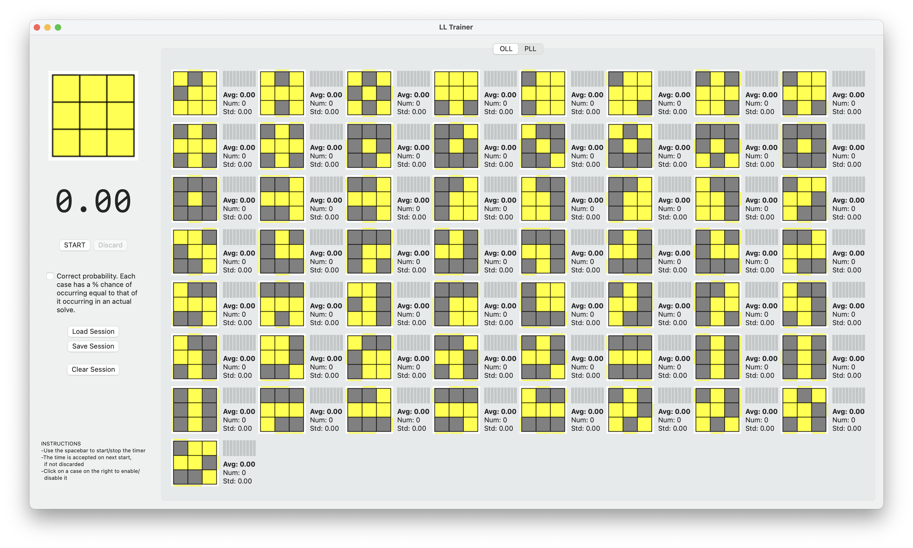

# LL-Trainer

Rubik's cube last layer trainer (OLL and PLL)

This application is based on the old Badmephisto and Zarxrax's OLL/PLL trainers.
I used their applications for years on Windows and on Linux and Mac with WINE.
When WINE stopped working on Mac, I decided to create a native application for this operating system.

The application is written in SwiftUI. The graphical interface follows the style of the old trainers (and it reuses the images of the cases).

## Instructions

You can click on the start/stop button or use the space bar to start and stop the timer. The time is saved on next start, if not manually discarded with the button.

It is possible to enable or disable the cases by clicking on them.

It is possible to save and load a session on disk.

The button clear session restarts the current stats.
